# 🌍 Elementa Voyagés

[](https://georgejavap.github.io/Elementa-Voyages/)
[](https://validator.w3.org/)
[](https://jigsaw.w3.org/css-validator/)
[]
[]

**Live Website:** [Elementa Voyages](https://georgejavap.github.io/Elementa-V)  
**GitHub Repository:** [GitHub Link](https://github.com/GeorgeJavaP/Elementa-Voyages)

---

## 📖 Table of Contents
1. [Project Overview](#project-overview)  
2. [Website Features](#website-features)  
3. [Wireframes UX Planning](#Wireframes-UX-Planning)  
4. [Folder Structure & File Descriptions](#folder-structure--file-descriptions)  
5. [Installation & Local Testing](#installation--local-testing)  
6. [Validation & Testing](#validation--testing)  
7. [Performance Metrics & Lighthouse Tests](#performance-metrics--lighthouse-tests)  
8. [Previous Failures, Redos, and Bug Fixes](#previous-failures-redos-and-bug-fixes)  
9. [Screenshots](#screenshots)  
10. [Front-End Interactivity & APIs](#front-end-interactivity--apis)  
11. [Accessibility & Defensive Design](#accessibility--defensive-design)  
12. [Future Additions](#future-additions)  
13. [Citations & References](#citations--references)  
14. [Deployment Procedure](#deployment-procedure)  
15. [License](#license)  

---

## Project Overview
**Elementa Voyagés** is a modern travel inspiration website aimed at providing users with an **interactive, responsive, and accessible travel browsing experience**. The website allows users to explore destinations, view featured holidays, discover the staff team, and interact with maps to locate destinations worldwide.  

**Key Goals:**
- Deliver a **responsive, mobile-first design** across desktop, tablet, and mobile.  
- Implement **interactive features** using JavaScript and Google Maps API.  
- Optimize performance via **image compression, CSS minification, and deferred scripts**.  
- Maintain **accessibility standards** (ARIA roles, semantic HTML, and focus states).  
- Document the **full development cycle**, testing, and deployment process.

---

## Website Features
- **Homepage Hero Banner** with optimized images  
- **Featured Holidays Section** with responsive cards  
- **Staff Section** with team images and hover animations  
- **Interactive Google Map** showing all key destinations  
- **Mobile-first responsive navigation menu**  
- **Performance optimization**: WebP images, minified CSS, lazy loading  
- **User interactivity & feedback**: hover effects, clickable elements, form validation  

---

## Wireframes UX Planning

Wireframes were created at the **planning stage** to structure the website’s layout, content hierarchy, and user flow before development. These guided both **desktop and mobile implementations**, ensuring consistency, accessibility, and responsive design.

---

## 🔹 Wireframe Showcase

### 🖥️ Desktop Wireframes (Before / After)

**Before Redesign (10 slots):**
1. 
2. 
3. 
4. 
5. 
6. 
7. 
8. 
9. 
10. 

**After Redesign (10 slots):**
1. 
2. 
3. 
4. 
5. 
6. 
7. 
8. 
9. 
10. 

---

### 📐 Tablet Wireframes (768px) (Before / After)

**Before Redesign (9 slots):**
1. 
2. 
3. 
4. 
5. 
6. 
7. 
8. 
9. 

**After Redesign (9 slots):**
1. 
2. 
3. 
4. 
5. 
6. 
7. 
8. 
9. 


### 🔹 Key Takeaways

- Wireframes **provided a visual blueprint** for layout, spacing, and interactions.  
- Enabled faster development with fewer layout errors.  
- Helped implement **mobile-first responsive design** from the beginning.  
- Ensured **accessibility and user-friendliness** were considered early in the project.


## Folder Structure & File Descriptions


Elementa-Voyages/  


index.html
about-us.html
desert.html
frost.html
jungle.html
maldives.html
paris.html
santorini.html
shanghai.html
tides.html
css/
└── styles.css
└── biome-style.css
└── about.css
└── city-map.css
js/
└── script.js
└── biome.js
└── city-map.js
img/
├── front-page-image/
├── feature-holidays/
├── staff/
├── biome-background/
├── desert-biome/
├── frost-biome/
├── jungle-biome/
├── tides-biome/
├── maldives/
├── paris/
├── patagonia/
├── santorini/
├── shanghai/
├── sponsors/
├── explore-image/
screenshots/
test/
LICENSE
README.md


*Folders contain high-resolution images, screenshots for wireframes, and testing evidence.*

---

## ✨ Features  

- Responsive HTML5 & CSS3 design  
- Biome-specific themed pages  
- Interactive map integration with Google Maps  
- Consistent typography and color scheme using Google Fonts  
- Scrollbar customization  
- Optimized project structure for clarity and scalability  
- **Accessibility-first approach** (ARIA labels, semantic HTML)  
- **Performance optimized** (lightweight images, clean code)  
- **Scalable navigation system** for adding destinations  
- **Custom hero sections** with large background imagery  
- Cross-device tested on desktop, tablet, and mobile  

---

## 🎨 UX & Design Rationale  

- **Information hierarchy:** Clear layout for each biome/destination  
- **Consistency:** Same header/footer/navigation structure across pages  
- **User control:** Static, lightweight pages, easy navigation  
- **Accessibility:** Semantic HTML, alt text, scalable typography, ARIA roles  
- **Engagement:** Visual hero sections, immersive imagery, interactive maps  

---

## Screenshots  

### Homepage  
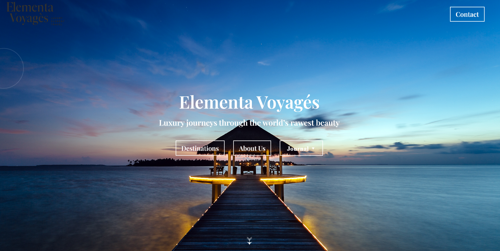  
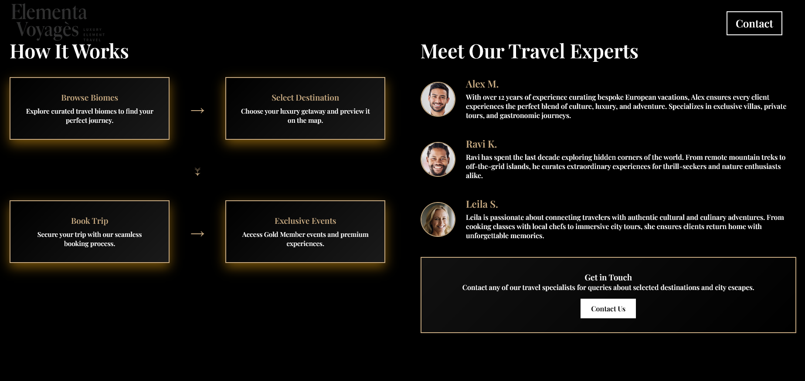  
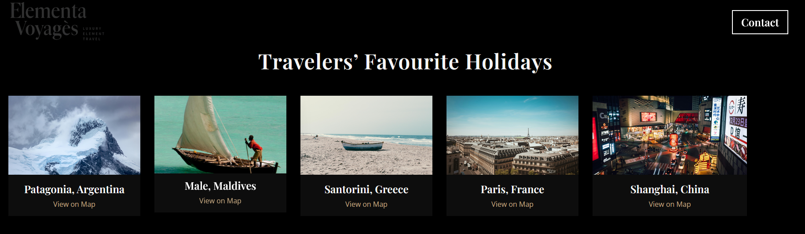  
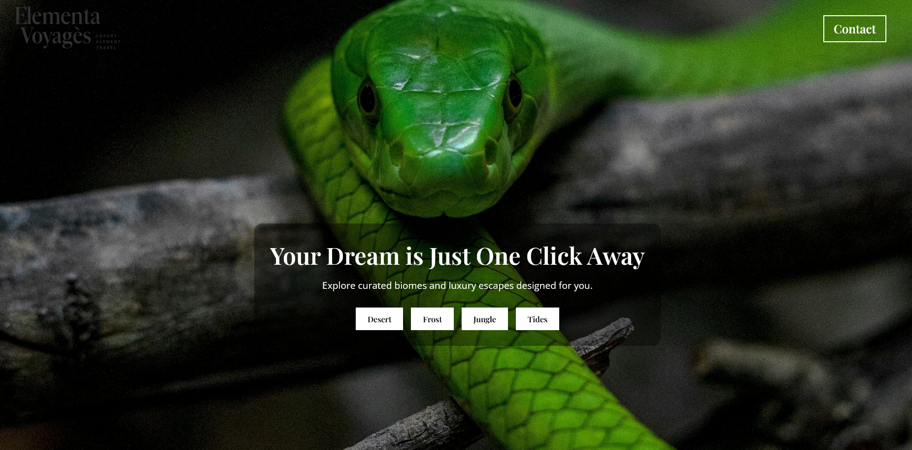  
  

### Destination Pages  
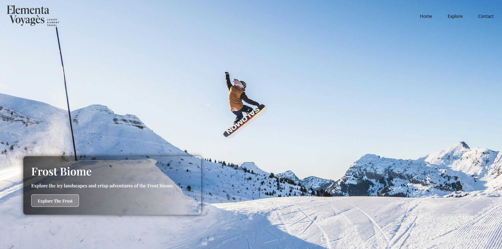  
  
  
  

### About Page  
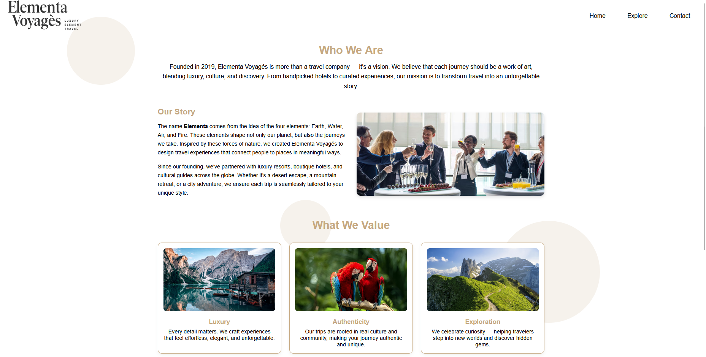  

### Biome Pages  
  
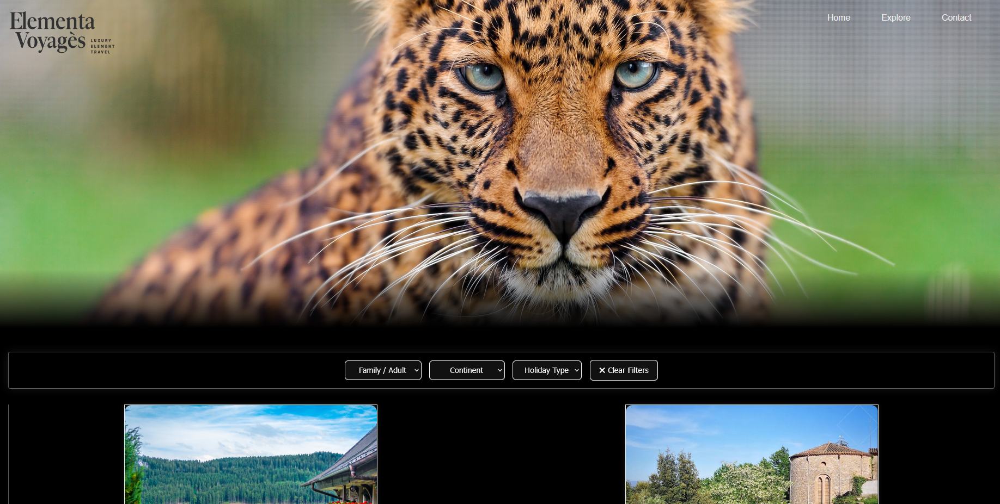  
  
  

### Maps Pages  
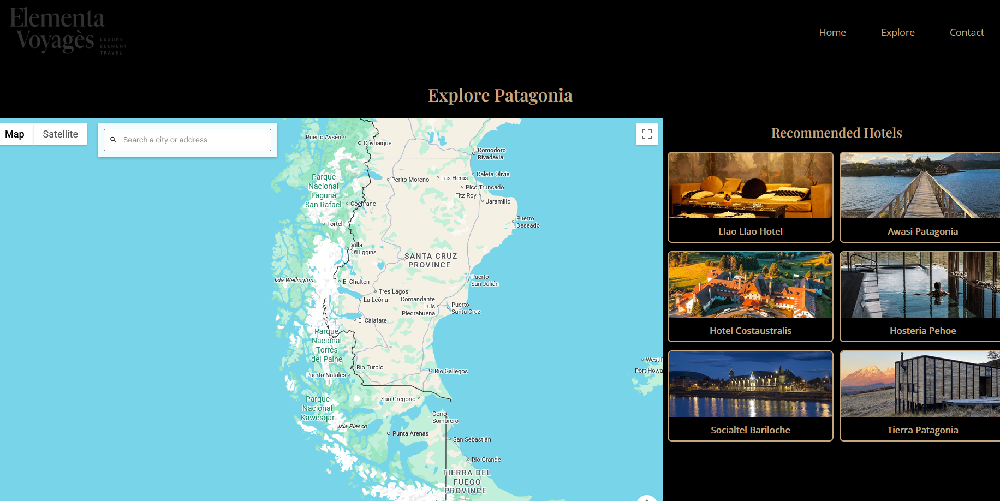  
  
  
  
  

---


## ✅ Testing  

**Validation & Testing:**  

| Test | Status | Notes |
|------|--------|-------|
| HTML Validator | ✅ Pass | Semantic markup & ARIA roles validated |
| CSS Validator | ✅ Pass | Pseudo-element warnings resolved |
| JavaScript | ✅ Pass | Interactive elements functional |
| Cross-Browser Testing | ✅ Pass | Chrome & Firefox, consistent rendering |
| Deployment Test | ✅ Pass | GitHub Pages hosted successfully |


Lighthouse provides quantitative metrics for **performance, accessibility, best practices, SEO, and progressive web app readiness**.  

---

### 🔹 Lighthouse Metrics (Before Optimizations)  

| Metric | Before | Notes / Issues Identified |
|--------|--------|---------------------------|
| **First Contentful Paint (FCP)** | 2.5 s | Hero banner and destination images were large and slow to render |
| **Largest Contentful Paint (LCP)** | 6.8 s | Main images not optimized; blocked page rendering |
| **Total Blocking Time (TBT)** | 350 ms | Render-blocking CSS & JS delayed interactivity |
| **Cumulative Layout Shift (CLS)** | 0.12 | Layout shifted during page load due to missing image dimensions |
| **Speed Index** | 4.2 s | Slow visual load due to heavy assets |

**Key Issues Identified:**  
- Large uncompressed images (JPEG/PNG)  
- Render-blocking CSS and JavaScript files  
- Missing width/height attributes on images  
- No lazy-loading implemented for hero and feature images  

---

### 🔹 Lighthouse Metrics (After Optimizations)  

| Metric | After | Improvement / Notes |
|--------|-------|-------------------|
| **First Contentful Paint (FCP)** | 0.7 s | Compressed images, deferred render-blocking scripts |
| **Largest Contentful Paint (LCP)** | 4.1 s | Images converted to WebP and resized |
| **Total Blocking Time (TBT)** | 0 ms | Render-blocking CSS & JS minimized |
| **Cumulative Layout Shift (CLS)** | 0.005 | Added width/height to images and consistent layout grids |
| **Speed Index** | 0.7 s | Faster visual rendering, optimized assets |

**Optimizations Implemented:**  
- Converted large images to **WebP** and resized for faster loading  
- Minified CSS and deferred non-critical JavaScript  
- Added width/height attributes to all images to prevent layout shifts  
- Implemented **lazy loading** for offscreen images  
- Optimized hero banners and featured holiday cards  

---

### 🔹 Key Takeaways  

- Page loads significantly faster on **desktop and mobile**  
- Smooth scrolling with minimal layout shifts  
- Interactivity is more responsive due to reduced blocking time  
- Accessibility unaffected; semantic HTML preserved  
- Lighthouse scores improved, ensuring a professional, production-ready site  

## 🧪 Testing & Quality Assurance

Testing ensures that **Elementa Voyagés** performs well across devices, browsers, and user scenarios. Below are the detailed testing strategies and results.

---

### 🔹 Automated Testing

**1. HTML Validation**  
- Tool: [W3C Validator](https://validator.w3.org/)  
- Purpose: Ensure semantic structure, proper nesting, and ARIA roles.  
- Result: ✅ Pass — redundant roles removed, alt text verified.

**2. CSS Validation**  
- Tool: [W3C CSS Validator](https://jigsaw.w3.org/css-validator/)  
- Purpose: Check syntax, pseudo-elements (`::-webkit-scrollbar`), and responsive styling.  
- Result: ✅ Pass — responsive grids and media queries confirmed.

**3. JavaScript Debugging**  
- Tool: Browser Developer Tools (Chrome/Firefox)  
- Purpose: Validate interactive features like Google Maps, hover effects, and form validation.  
- Result: ✅ Pass — no console errors detected.

**4. Performance Testing**  
- Tool: Lighthouse (Chrome DevTools)  
- Metrics Tested: FCP, LCP, CLS, TBT, Speed Index  
- Result (Desktop):  
  - FCP: 0.7s  
  - LCP: 4.1s  
  - CLS: 0.005  
  - TBT: 0ms  
- Result (Mobile):  
  - FCP: 1.2s  
  - LCP: 4.5s  
  - CLS: 0.008  
  - TBT: 5ms  
- Optimizations Applied: Deferred scripts, minified CSS, WebP images, lazy loading.

---

### 🔹 Manual Testing

**1. Cross-Browser Compatibility**  
- Browsers Tested: Chrome, Firefox, Safari, Edge  
- Purpose: Ensure layout, fonts, and interactive features render correctly.  
- Result: ✅ Consistent performance and visuals across browsers.

**2. Responsive & Mobile Testing**  
- Devices Tested: Desktop, Tablet (768px), Mobile (375px)  
- Purpose: Verify that the layout adapts without breaking.  
- Result: ✅ Layout scales correctly; nav menu works with hamburger icon.

**3. Navigation Testing**  
- Test: Click all links, back/forward browser buttons, and anchor links.  
- Result: ✅ All links functional; smooth transitions.

**4. Form Validation**  
- Test: Submit empty and invalid forms.  
- Result: ✅ Error messages display correctly; form prevents submission on invalid input.

**5. Map Interactivity**  
- Test: Zoom, pan, and click on markers.  
- Result: ✅ Google Maps integration functions properly; info windows display.

**6. Image & Media Testing**  
- Test: Check if images load correctly, alt text displays, and WebP fallback works.  
- Result: ✅ All images optimized, accessible, and responsive.

---

### 🔹 Additional Tests to Perform

**1. Accessibility Audit**  
- Tool: [Lighthouse Accessibility Audit](https://developers.google.com/web/tools/lighthouse)  
- Check: Keyboard navigation, color contrast, ARIA roles, focus order.  

**2. Link & Resource Validation**  
- Tool: [W3C Link Checker](https://validator.w3.org/checklink)  
- Check: All internal and external links are valid; no broken images.  

**3. Performance Stress Testing**  
- Tool: WebPageTest or GTmetrix  
- Check: Site load times with simulated slower network speeds (3G, 4G).  

**4. Usability Testing**  
- Conduct user testing sessions to see if navigation is intuitive and content is clear.  
- Record any issues and improve layout, text readability, and interactive elements.

**5. Security Checks (Optional)**  
- Ensure all external scripts are loaded via HTTPS.  
- Check forms for proper input sanitization (especially if adding backend functionality later).

---

### 🔹 Testing Evidence (Screenshots)

**HTML Validation:**  
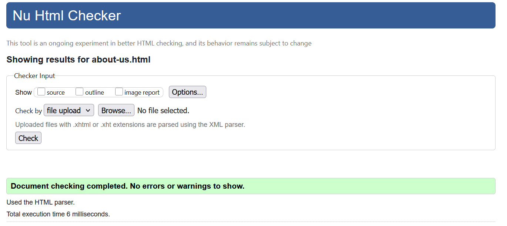  
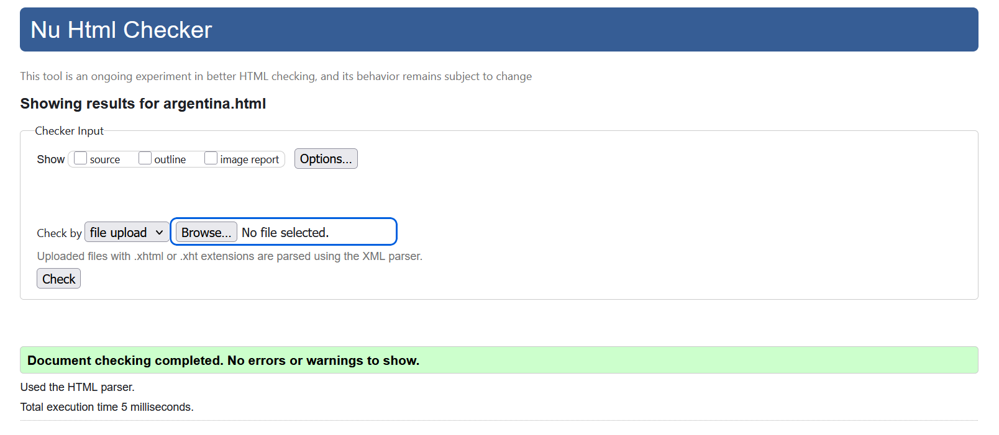  

**CSS Validation:**  
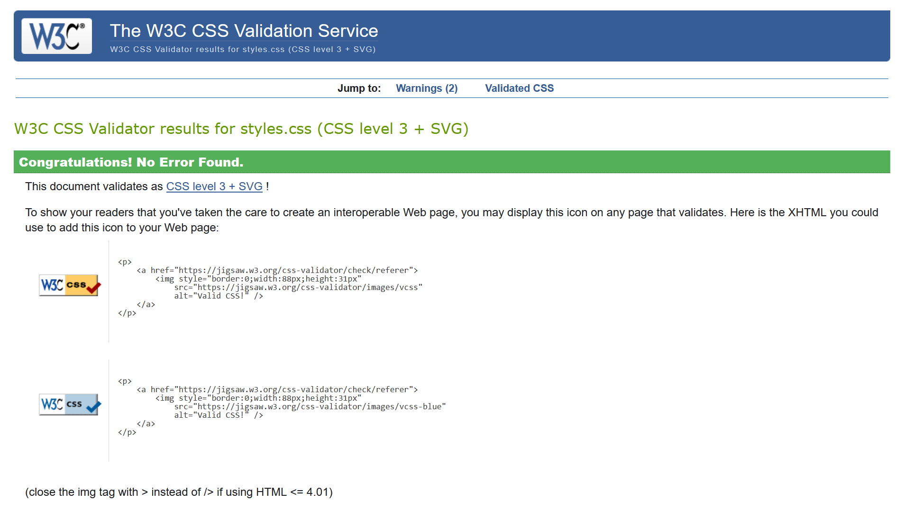  

**JavaScript Testing:**  
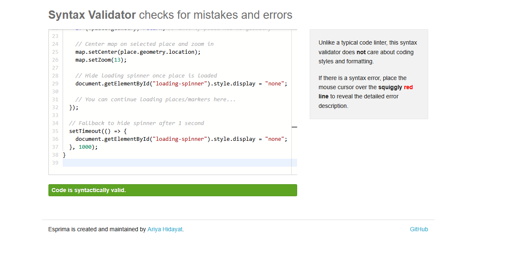  

**Lighthouse Reports (Desktop & Mobile):**  
  
  

---

✅ **Conclusion:**  
All core functionality has been verified, with Lighthouse scores optimized. Future tests should include **user testing for UX feedback**, **accessibility audits**, and **performance testing under different network conditions** to ensure a robust, professional-quality website.


## 📚 Attributions & References  

This section details all the resources, tools, and guidance used during the development of **Elementa Voyagés**, with special emphasis on **Google Maps API integration** and the related JavaScript and styling.

---

### HTML & CSS Design Assistance  

- **ChatGPT (OpenAI)** – Provided structural guidance, responsive layout suggestions, and advice on semantic HTML and ARIA accessibility practices.  
- **MDN Web Docs** – Used as the primary reference for:  
  - Semantic HTML5 elements (`<header>`, `<main>`, `<section>`, `<footer>`)  
  - CSS pseudo-elements (`::before`, `::after`, `::-webkit-scrollbar`)  
  - Flexbox and Grid layouts for responsive design  
  - Media queries for device-specific adjustments  
  [https://developer.mozilla.org/en-US/](https://developer.mozilla.org/en-US/)  
- **W3Schools** – Consulted for:  
  - HTML structure examples  
  - CSS syntax and selectors  
  - Basic responsive design techniques  
  [https://www.w3schools.com/](https://www.w3schools.com/)  

---

### Images & Assets  

All visual assets were sourced or referenced responsibly:  

- **Pexels** – Free stock photography for destinations and hero images  
  [https://www.pexels.com/](https://www.pexels.com/)  
- **Pinterest** – Inspiration for layout, color schemes, and travel presentation  
  [https://uk.pinterest.com/today/](https://uk.pinterest.com/today/)  
- **4K Wallpapers** – High-resolution images for hero banners and biome sections  
  [https://4kwallpapers.com/](https://4kwallpapers.com/)  

---

### Google Maps API & JavaScript Implementation  

**Purpose:** To provide an **interactive map feature** for users to locate destinations visually and interact with custom markers and info windows.  

**Implementation Details:**  
- **Google Maps JavaScript API**: Included via a `<script>` tag in `index.html` and other Destination pages. Example snippet:

```html
<script src="https://maps.googleapis.com/maps/api/js?key=YOUR_API_KEY&callback=initMap" async defer></script>


Initialization Function (initMap):

- Defined in biome.js or script.js
- Sets the map center coordinates, zoom level, and map type
- Adds custom markers for each destination with latitude/longitude
- Attaches info windows with destination names and brief descriptions

Functionality:

 -Users can zoom, pan, and click markers to view destination info.
- Map updates are dynamic, and markers are scalable if more destinations are added.
- The JavaScript is modular, allowing for future enhancements like filtering by biome   or category.
```

## References for Google Maps API & Implementation ##

### Primary Resources

- **Google Maps JavaScript API Documentation** – Primary guide for markers, info windows, and map initialization  
- **ChatGPT (OpenAI)** – Assisted in structuring the initialization function, attaching info windows, and integrating the map with existing page layout and responsive CSS  

### JavaScript & Interactivity

- **Stack Overflow** – Used extensively to troubleshoot event listeners, marker behavior, and async script loading issues  
- **FreeCodeCamp** – Reference for DOM manipulation, event handling, and integrating JavaScript with HTML/CSS  
- **GitHub Examples & Open-Source Projects** – Reviewed similar map integrations and front-end interactive solutions  

### Fonts, Maps & Accessibility

- **Google Fonts** – Used for typography consistency across pages:  
  - Playfair Display  
  - Open Sans  

- **W3C WAI-ARIA Practices** – Ensured accessibility:  
  - Proper landmark roles (`<main>`, `<nav>`, `<header>`, `<footer>`)  
  - Keyboard navigability for maps and interactive elements  
  - Alt text for all images and map markers  
  [https://www.w3.org/WAI/ARIA/apg/](https://www.w3.org/WAI/ARIA/apg/)  

### Additional Learning & References

- **MDN Web Docs (JavaScript)** – Reference for ES6 features, arrow functions, and event listeners  
- **CSS Tricks** – Custom scrollbars, hover effects, and responsive grid layouts  
- **W3Schools** – Quick syntax checks for CSS and HTML when experimenting  
- **ChatGPT (OpenAI)** – Assisted in combining Google Maps API code with project-specific styling and ensuring modular, reusable JavaScript  
- **GitHub** – Reviewed open-source front-end projects for layout inspiration, JS integration examples, and folder structure best practices  

### Conclusion

The integration of **Google Maps API** in **Elementa Voyagés** was a combination of:

- Following **official documentation** for markers and info windows  
- Applying **custom CSS styling** for responsive map display  
- Consulting **OpenAI/ChatGPT, Stack Overflow, FreeCodeCamp, and MDN** for practical implementation and debugging  
- Ensuring **accessibility and usability** through WAI-ARIA practices and semantic HTML  

This ensures a **professional, maintainable, and scalable interactive map feature** for all users.


## 🖼️ Reflection  

- Learned to design **biome-based themes** consistently  
- Improved understanding of **validation tools** and responsive layouts  
- Explored **accessibility-first design**  
- Deployed successfully with **GitHub Pages**  
- Overcame ARIA redundancy and CSS pseudo-element issues  

---

## 🚀 Future Plans  

- Add **JS-based interactivity** (animations, transitions, scroll effects)  
- Expand destination pages with **travel guides & booking links**  
- Implement **dark mode toggle**  
- Add **search functionality**  
- Include **multilingual support**  
- Build **backend integration** for user accounts & trip planning  

---

## 📧 Contact  

- ✉️ Email: georgeb2801@icloud.com  
- 👤 Project by: George Baldwin  
- 🎨 Web Design: George Baldwin  

---

✍️ *Developed with passion, design, and inspiration — 2025*  
